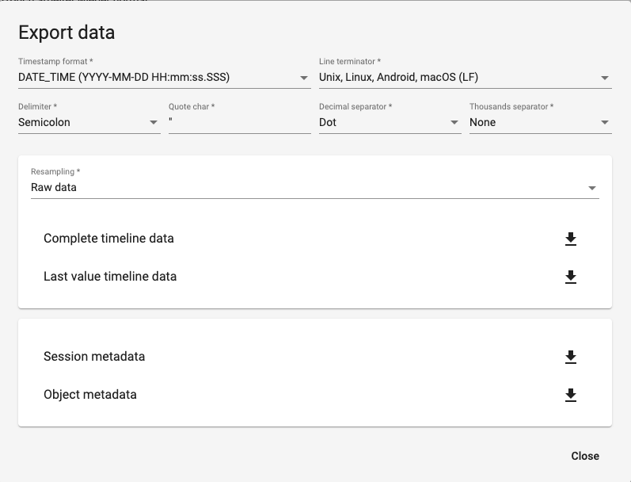

# EmoTouch™ script

Here are some python scripts to parse the output data from the EmoTouch web application.

---

## Running the script

The files to be processed must be in the folder `input/`
(whose content isn't uploaded to the repo, but kept in the file structure).

1. Activate virtual environment.
   
   ```shell
   source .venv/bin/activate
   ```

2. Run main script:
   
   ```shell
   python EMOTOUCH.py
   ```

3. Choose `emoTouch` file to process (`TAB`, then click on file).

4. The resulting `.csv` file, and the respective plot will be saved
   in the `output/` folder.

---

## Exporting emoTouch session data

Go to the study / session, and click `export`.

1. Go to [EmoTouch Web](https://ri.emotouch.de/en/home)

2. Click on the play ▶ icon

3. Go to *realisations* (click on a specific one)

4. Go to *sessions*

Specifically download the file called **Zeitreihendaten** (*Timeline data*)
in **csv** format.

- Line terminator char `should be Unix/linux/macOS`?
- Delimiter `Tab?`
- Quote char: `unchanged`
- Decimal separator `Dot`
- Thousands separator `None`


